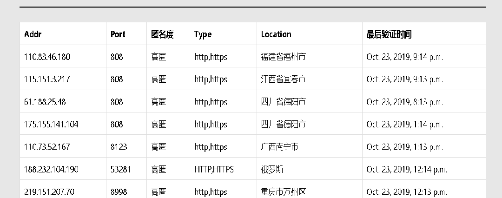

免费的中国代理，网站列表
```
[1]: lab.crossincode.com
[2]: 89ip
[3]: www.ip3366.net
[4]: ip.jiangxianli.com
[5]: www.kuaidaili.com
[6]: www.xsdaili.com
[7]: www.xicidaili.com
[8]: www.superfastip.com
[9]: www.freeip.top
```

### 安装

```
pip install freeproxy_cn
```


### 使用

1. 循环抓取代理

```python
>>> from freeproxy_cn import Engin
>>> import asyncio
>>> valid_url = 'http://icanhazip.com'
>>> loop = asyncio.get_event_loop() #不传参默认的valid_url 为http://icanhazip.com
>>> loop.run_until_complete(Engin(valid_url).run())
```

2. 获取代理

**默认的代理存在redis的key为`http://icanhazip.com`中，实际情况中需要自己定义，例如你想抓取`https://www.baidu.com`，需要给engine传入`valid_url='https://www.baidu.com'`，并且使用`https://www.baidu.com`获取代理**

```python
>>> from redis import Redis
>>> rds = Redis()
>>> rds.spop(valid_url) 
192.168.1.1
```

### 参数说明

| Engin参数      | 含义                                                                                                                           |
| -------------- | ------------------------------------------------------------------------------------------------------------------------------ |
| redis_host     | 存储代理的redis的host                                                                                                          |
| redis_port     | 存储代理的redis的port                                                                                                          |
| redis_password | 存储代理的redis的password                                                                                                      |
| redis_db       | 存储代理的redis使用哪个db,默认为0                                                                                              |
| valid_thread   | 用于验证代理有效性的线程数目，默认为4，想加快验证的可以适当增大该参数                                                          |
| valid_per_time | 每批验证多少个代理地址，默认20个，可以适当增大该参数加快验证                                                                   |
| valid_url      | 默认为一个返回请求IP[网站](http://icanhazip.com),这个网站没有区分http和https，**实际中需要换成自己要抓取的目标网站来验证代理** |
| valid_timeout  | 验证超时时间设定，默认为5秒                                                                                                    |
### 改进

可以使用一个web服务器代替redis进行代理提供，暂时还没有写

### 更新日期

2019-12-23

### 提交

这里只有一部分代理网站，如果你有新的代理网站可以写代码提交。

1. 如何实现:
首先来看示所有抓取代码的父类:

```python
class Channel(object):
    site_name = 'site'
    start_urls: list = []  # 抓取的页面

    def __init__(self, debug=False, *arg, **kwargs):
        self.http_handler = AsyncHttpHandler()
        self.start_pos = 2
        self.positions = [1, 2]
        self.xpath_plt = './td[position()={}]//text()'

    async def bootstrap(self):
        '''
        如果start_urls为空，需要继承该函数初始化start_urls
        '''
        return

    async def run(self):
        '''
        抓取主函数
        '''
        self.session = aiohttp.ClientSession()
        await self.bootstrap()
        rst = []
        for url in tqdm(self.start_urls, desc=f'{self.site_name} Grab'):
            proxies = await self.handle(url)
            rst += proxies
        await self.session.close()
        return rst

    async def handle(self, url: str) -> List[Tuple[str, str]]:
        '''
        模板解析函数
        '''
        doc = await self.http_handler.get(self.session, url) >> to_doc
        items = doc.xpath("//table//tr[position()>=%s]" % self.start_pos)
        proxies = []
        for item in items:
            host_position, port_position = self.positions
            host = item >> xpath(self.xpath_plt.format(
                host_position)) >> head >> trim
            if not host:
                # 匹配失败
                continue
            port = item >> xpath(self.xpath_plt.format(
                port_position)) >> head >> trim
            if len(port) > 5:
                continue
            proxies.append((host, port))
        return proxies
```
首先来看`run`函数,它定义了抓取流程，首先获取所有要抓取的url,然后开始抓取(这个地方可以看情况改成并发的)获取所有的url并进行解析,该函数一般不需要重写

如何继承：
1. 当`start_urls`为空的时候,需要自己实现bootstrap来填充`start_urls`
2. 需要自己自定义`site_name`
3. 上面的`handle`函数是一个解析模板，因为大部分的网站的页面一个`table`，每行(tr)是一条包含**host**和**port**。**start_pos**定义了从第几行开始是可以解析出代理地址的`tr`,**postions**定义了**host**和**port**在`tr`中的位置(参考`site/freeip.py`)，
    
    例如上面的图片，start_pos为2，因为第一行为表头，positions为[1,2],因为host在每列的第一`td`,port在每列的第二个`td`，该图片对应代码`site/crossin.py`
4.如果你抓取的网站不符合上面的模板需要自定义handle函数，参考`site/eight9.py`

> 注意上面的position从1开始
